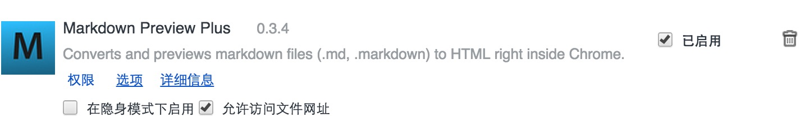
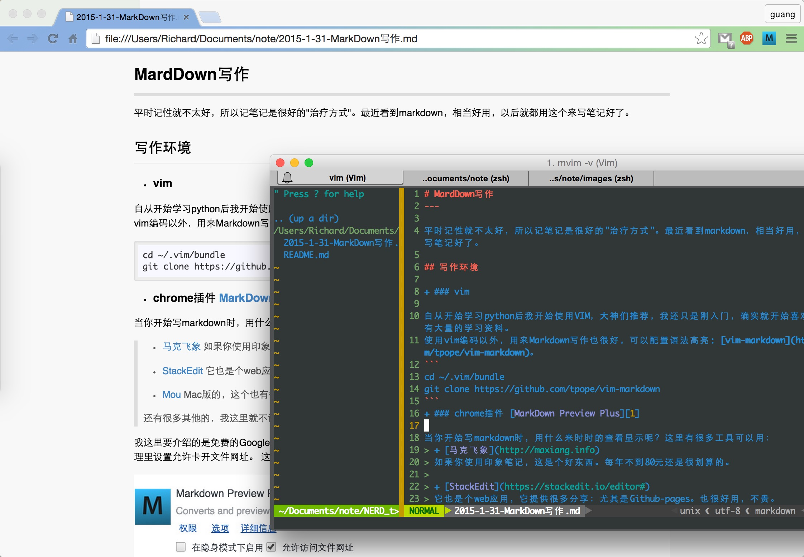

# MardDown写作
---

平时记性就不太好，所以记笔记是很好的"治疗方式"。最近看到markdown，相当好用，以后就都用这个来写笔记好了。

## 写作环境

+ ### vim

自从开始学习python后我开始使用VIM，**大神们推荐**，我还只是刚入门，确实就开始喜欢上它了。网上有大量的学习资料。
使用vim编码以外，用来Markdown写作也很好，可以配置语法高亮: **[vim-markdown](https://github.com/tpope/vim-markdown)**。
```
cd ~/.vim/bundle
git clone https://github.com/tpope/vim-markdown
```
+ ### chrome插件 [MarkDown Preview Plus][1]

当你开始写markdown时，用什么来时时的查看显示呢？这里有很多工具可以用：
> + [马克飞象](http://maxiang.info)
> 如果你使用印象笔记，这是个好东西。每年不到80元还是很划算的。
> 
> + [StackEdit](https://stackedit.io/editor#)
> 它也是个web应用，它提供很多分享：尤其是Github-pages。也很好用，不贵。
> 
> + [Mou](http://25.io/mou)
> Mac版的，这个也有很多粉丝。
> 
> 还有很多其他的，我这里就不说了，我就试过这几个。

我这里要介绍的是免费的Google Chrome浏览器上的App。可以让你实时的观看你写的文章。
把他添加到你Chrome里，插件管理里设置允许卡开文件网址。
这个App还可以设置允许设置自动刷新, CSS式样。



打开一个文件可以拖拽进入Chrome, 但我更喜欢在命令行里：

	$ open -a Google\ Chorome filename

这样，我就能变写变看了。是不是很棒？
看看效果图：




## 参考资料
> + [MarkDown中文文档](http://wowubuntu.com/markdown/)
> + [MarkDown快速入门](http://wowubuntu.com/markdown/basic.html)

[1]: https://chrome.google.com/webstore/detail/markdown-preview-plus/febilkbfcbhebfnokafefeacimjdckgl

