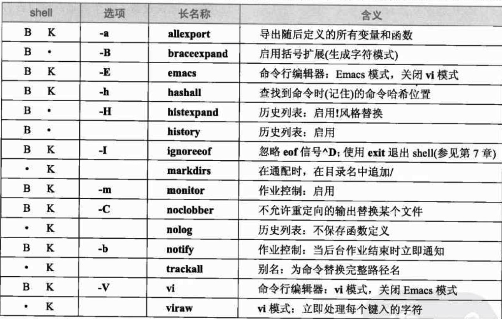

# unix&linux大学教程笔记1
---

## 1. 什么是Unix, Linux.

Unix是一种多用户，多任务处理的操作系统，Linux是Unix系统的一个特定家族。

计算机启动->引导程序->内核(总是一直运行)

内核基本服务：
+ 内存管理
+ 进程管理
+ 进程通信
+ IO
+ 文件管理
+ 安全访问
+ 网络访问

Unix=内核+实用工具（shell,GUI,等）


## 2. 使用Unix

### 2.1 CLI 常用命令

#### 2.1.1 以超级用户工作：su , sudo

	$ su weedly

su将用户标示切换到weedly, 将当前shell挂起。要结束是输入exit就可以了。

	$ sudo command

以超级用户权限单独运行一条命令

#### 2.1.2 打印出环境变量：

	$ printenv

#### 2.1.3 常用键盘输入信号：

> ctrl+w: 删除输入的最后一个单词  
> ctrl+x / ctrl+u: 删除整行  
> ctrl+c: 停止证运行的程序  
> ctrl+\: 停止程序并保存core文件  
> ctrl+s: 暂停屏幕显示  
> ctrl+q: 重新启动屏幕显示  
> ctrl+d: 指示已经没有数据  

(stty可以修改映射键)

#### 2.1.4 查找程序

	which date

运行后告诉你执行date程序使用的是哪个位置的程序。还有备用的命令：type, whence都是用来查找程序。

#### 2.1.5 查看系统信息

	uptime

显示系统已经运行多长时间（连续运行）.

	hostname

显示当前计算机名称。uname可以显示当前操作系统，uname -a显示全部信息。

	whoami

显示自己的信息。

	users

显示当前登录系统的所有用户标示。

#### 2.1.6 计算器

	bc

内置计算器。还有一个基于栈的计算器：dc

#### 2.1.7 查询手册

	man

查询命令的手册。

如果知道干嘛不知道用什么命令：apropos xxx

	apropos manual

它会列出可能的程序。


### 2.2 命令语法

#### 2.2.1 一次输入多条命令

可以使用命令分隔符“;”

	date; cal
	cp data backup1; cp data backup2; rm data; ls

### 2.3 Shell

Bourne Shell家族：sh, ksh, bash  
C-Shell家族：csh, tcsh

查看系统中的shell:

	cat /etc/shells

查看当前使用的shell名称:

	echo $SHELL

#### 2.3.1 环境变量和shell变量

变量包括环境变量和shell变量。环境变量是所有的进程都可以用的，而shell变量是只在特定的shell中使用，并不属于环境。

如果要将某变量同时成为环境变量，必须使用export的特殊命令。这就将一个变量导出到环境中。

可以使用unset [-fv] 变量名，来删除环境变量。
```
TEMPENV_VAR=haha
export TEMPENV_VAR
printenv | less
unset -v TEMPENV_VAR
printenv | less
```
(还可以使用sort,按照字母顺序排序: printenv | sort | less)

**显示shell变量：set**  

对于C-shell来说，shell变量都是小写。Bourne shell来说，都是大写。

C-shell使用shell变量控制shell的行为，Bounrne shell使用"**shell选项**"。

**print, echo(首选)来打印变量的值：**

	echo i love unix.
	print i love unix.

**显示一个变量：${xxx}, **如果没有歧义可以省略花括号。但随时使用花括号是好习惯。

如果要输出如 <, > 这些重定向的符号：

	echo "The terminal type is <$TERM>"


#### 2.3.2 shell选项

关闭这个选项就说“**复位**”了这个选项。

shell选项设置的方式有两种：1. 可以以普通的方式指定选项，即为命令指定一个或多个选项。2. 使用set命令的一种变体：set -o option, 或关闭：set +o option。

例如，shell支持一个叫“作业控制”的功能，允许在后台运行程序。需要设置monitor选项。默认下，交互式的shell中monitor是打开的。Korn shell的开启方式：1. ksh -m  。2. set -o monitor 。 复位monitor选项：set +o monitor。

一般来说我们不需要设置选项.



也可以使用set -o 或者set +o来查看当前值。

#### 2.3.3 命令

**元字符**，shell中又有许多有特殊含义的字符，例如，命令分隔符“;”; 引用变量的“$”符。前面还说过，要打印出这些特殊符号需要使用“"X"”来打印。除了使用引号转义还可以使用反斜杠"\"。

	echo It is warm and sunny\; come over and visit.

使用单引号，是强引用，它将全部转义，而使用双引号是弱引用。

	echo "My userid is <$USER>; my terminal is <$TERM>"
	echo 'My userid is <$USER>; my terminal is <$TERM>'

**内置命令**, 输入man builtin. 可以看到所有内置命令。

**外部命令**，如果不是内置命令，shell将要寻找出合适的程序来执行。例如我们可使用 type command来查看，如果是内部命令将说是builtin. 否则会找出该命令的程序位置。

shell搜索路径在PATH变量中，我们可以将新程序路径加入到其中。这样就可以被shell找到。例如：

	export PATH="$PATH:$HOME/bin"

**命令替换**，允许在一条命令中嵌入一条命令。通过将命令封装在“\`”（反引用中）:

	echo "The time and date are `date`."

**命令修复**, fc (fix command)可以修复上一条命令。
```
$ fc -l -2   # 列出最近2个命令
$ fc -s foo=bar cc  # 要找到以 cc 字符开始的命令，且将 foo 更改为 bar，并显示和执行该命令
$ fc -s 500   #执行history里第500个命令
$ fc -t    # 列出先前执行的命令和时间
```

关于history：
```
$ history
$ !900    # 调出第900的命令
```

#### 2.3.4 别名：alias, unalias

我们可以将常用的命令取别名，这样，我们可是更快的使用：

	alias cls='clear'
	alias ls="ls -l"

将他们设置到.zshrc (或者.bash\_profile)中，让每次启动shell时都默认使用。unalias，可知他是移除别名的。unalias cls

临时挂起别名，如果临时不想用某别名，可以前面加反斜杠就可以挂起一个别名：

	\ls

#### 2.3.5 初始化文件

Bash里初始化文件是.bash\_profile   
环境文件是 .bashrc  
注销文件是 .bash\_logout

它们分别在登录时，新shell启动时和注销时执行。

非登录shell只执行环境文件，登录shell则会执行登录文件和环境文件。

**注释**使用 # 符号, 正如上一节所示。


### 2.4 重定向和管道

#### 2.4.1 重定向

重定向，使用 > 将前面的命令输出到后面文件：

	ls | sort > ls.txt   # 将目录下文件列表排序后输出到ls.txt文件中
	ls | sort >> ls.txt  # 使用>>表示将内容追加到文件尾部

屏蔽文件被替换：set -o noclobber。如果这样设置，我们直接输入之前的命令时会提示：zsh: no such file or directory: ls.txt。这个情况下，如果我们确实需要替换，需要使用 >| 或者 >>| : ls | sort >| ls.txt. 

	$ sort < ls.txt  # 将一个文件的内容排序输出到屏幕。
	$ sort < ls.txt > otherfile.txt  # 将输出再重定向到其他文件中

Bash的标准输入输出语法：
	
	$ command 0< inputfile   # standard input
	$ command 1> outputfile  # standard output
	$ command 2> errorfile   # standard error

只是默认情况下省略掉数字，而标准错误输出不能省略。

**子shell**就是一个shell的子进程的意思，例如在一个shell中输入bash等，它开启的一个非登录shell就是上一个shell的子shell，可以ctrl+d, exit结束子shell.子shell中会继承父shell的环境。而子shell中修改的环境将不会改变父shell。

因为对父shell没有影响，对环境没永久影响，所以子shell很有价值。我们还可以用圆括号包含一组命令。被称为**编组**，它可以认为是子shell的一种。用他们最常见的一种运用就是cd防止改变当前位置。

	$ (cd dir; command) # 执行完后可以回到目录不变

**组合标准输入输出**：
	
	$ sort 1> output 2>&1  # 标准输出到output，标准输出也被重定向到标准输出相同的位置
	$ sort 1>> output 2>&1 # 这是追加的形式

**抛弃输出**: 假设有一个update程序，它的输出重定向到/dev/null (发送给它的任何东西都会消失)

	$ update > /dev/null 
	$ update 2> /dev/null

#### 2.4.2 管道

统计文件中某关键字的单词个数。

	$ cat file1 file2 file3 > tempfile1     # combine files
	$ grep KeyWord < tempfile1 > tempfile2  # get all *KeyWord* words
	$ wc -l < tempfile2                     # count words
	$ rm tempfile1 tempfile2                # clear

如果使用**管道**,就简单了。管道线(pipeline):" | "。

	$ cat file1 file2 file3 | grep KeyWord | wc -l

**管道线分流：tee**:

tee作用就是从标准输入读取数据，并向标准输出和一个文件各发送一份数据。

	# 读取cat出来的数据到masterlist, 并标准输出包含Harely的字母。
	$ cat file1 file2 file3 | tee masterlist | grep Harely 

#### 2.4.3 条件执行

	command1 && command2     # c1成功才执行c2
	command1 || command2     # c1成功执行，否则执行c2

	# 通常会这么用，update程序执行成功，否则打印错误信息。
	$ update || echo "The update program failed."

查看上一个命令是否执行成功：
	
	$ echo $?    # 返回非0表示失败，0表示成功


### 2.5 过滤器

过滤器就是任何能从标准输入读取文本数据并向标准输出写入文本数据的程序。例如：sort, cat, grep。而less不是。

#### 2.5.1 split 划分文件

	split [-d] [-a num] [-l lines] [file [prefix]]
	# num 创建文件名时用作文件后缀的字符数量
	# lines 是每个新文件所包含的最大数量
	# file是输入文件，prefix是新文件名字

默认下，创建1000行长文件。新文件默认是x开头的后面跟两个字符的名称：xaa,xab,xac...。使用-d选项，将使用数字后缀：x00,x01,x02,x03...。

	$ split -d -a 3 -l 5000 data harley
	# output file :harley000,harley001,harley002,...

#### 2.5.2 其他 

**用于显示**

+ cat 显示文本
+ tac 组合文件时反转文本行顺序 (要注意的是，OS X 没有tac)
+ rev 反转字符顺序
+ head, tail 从数据开头或末尾开始
+ colrm 删除数据列 colrm [startcol [endcol]]

```
$ tac log > reverse_log
来就是cat反过来。一般用来查看log日志。

$ tac log | less
$ tac log1 log2 log3 | less

$ rev data
# 每一行反向，12345 -> 54321

$ rev data | tac
# 每行字符反向，文件行顺序反向

$ cat data1 data2 | sort | head -n 20
$ cat data1 data2 | sort | tail -n 20

$ tail -r -n 20 filename  # 最后20行逆序输出
```

**比较过滤器：**

+ cmp: 比较两个文件
+ comm: 比较两个有序文件，显示区别
+ diff: 比较两个文件，显示区别
+ sdiff: 比较两个文件，显示区别

```
$ diff old-names new-names    # 比较，只显示出不同的地方
$ # -i 不区分大小写; -B 忽略空白行; -c 显示上下文关系; -u 统一输出
$ diff -y old-names new-names # 分两边对比显示
$ sdiff old-names new-names   # 与diff -y 等价(s: side-by-side)
```

**抽取过滤器：**

+ cut: 提取指定列（字段）
+ paste: 组合数据列
+ sort: 排序
+ uniq: 选取重复/唯一行
+ grep: 选取包含的模式行
+ look: 选取指定模式开头的行

```
$ who | cut -c 1-8  # 查看登录到系统中的每个用户
$ who | cut -c 1-8 | sort | uniq -c  # 统计登录的用户
$ cut -f 1 -d ":" /etc/passwd    # passwd数据里用“:”分割后的第一列
$ cut -f1,3-5 -d":" /etc/passwd  # 第1，3，4，5个字段(filed)

$ paste idnumber name birthday phone > info  # 按列的格式将files复制到新文件
$ paste -d ' ' idnumber name birthday phone > info  # 默认制表符改成空格
$ paste -d '|%' idnumber name birthday phone > info # 轮流|%做制表符
```

**统计**：

+ nl: 创建行号
+ wc: 统计行，单词，字符

```
$ nl file          # 显示是创建行号在最前
$ nl -v 100 file   # 行号从100开始
$ nl -i 5 file     # 行号的增量为5

$ wc poem          # 2 13 71 poem (行数，单词数，字符数)
# -l 行 -w 单词 -c 字符
$ wc poem message story  # 可以统计多个文件
$ ls | wc -l       # 显示当前目录下文件个数
```

**格式化**

+ expand, unexpand 制表符空格相互转化
+ fold 格式化行
+ fmt 格式化段落
+ pr 格式化列

**制表符**，默认下，每隔8个字符有一个制表符，所以Unix的制表位为1，9，17，25，33...

在vi/vim中，:set list 将显示制表符：空格不可见，^I表示制表符，$表示回车. (:set nolist设置不显示制表符)

将制表符转为空格：expand. 将空格转为制表符：unexpand

```
$ fold -w 40 long-lines > shortlines  # 将不超过40个字符的行保存到shortlines # 默认是80字符
$ fold -w 13 alphabet    # 将alphabet中每行13个字符后加入一个回车显示
$ fold -s -w 40 speech   # 将speech每行40个字符出加入回车，并且不分割单词

$ fmt -w 50 secret-raw > secret-format  # 保存为50个字符行宽的文本,不分隔单词
$ fmt -u -w 50 secret-raw  # -u 单词距离为1空格

$ pr -2 -l 48 file     # 按两列，48行作为1页显示
```

#### 2.5.3 实例

to do ( 第19章 , p400)


### 2.6 正则表达式
to do ( 第20章 )

### 3 vi

以只读方式启动vi

	$ vi -R importantfile
	$ view importantfile

ZZ 可以关闭vi. 并会保存修改。

(略)

